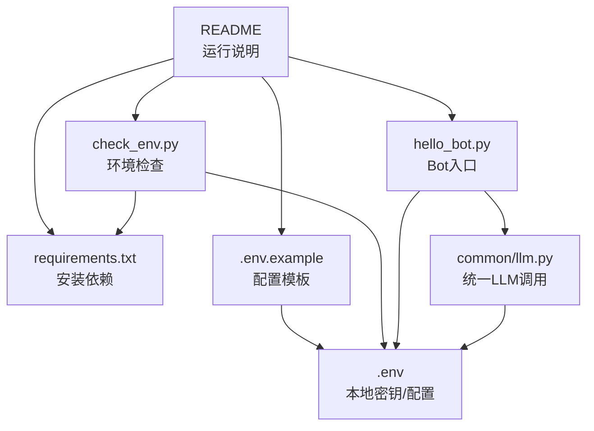
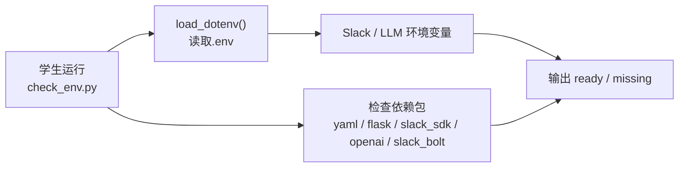
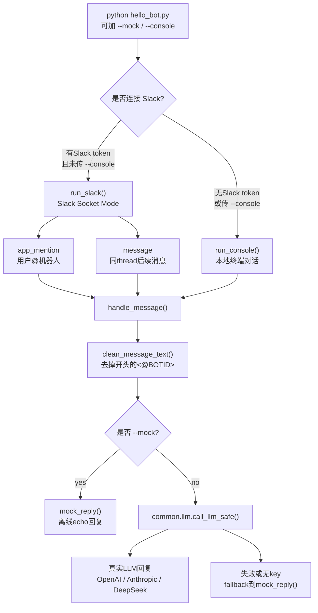

# 项目架构：Session 1 主逻辑文件关系

第 1 课只需要理解环境检查、Hello Bot、统一 LLM 调用入口之间的关系。本文刻意忽略测试文件、本地虚拟环境、缓存文件和后续 session 文件，避免架构图过早变复杂。

完整课程（14 个 session、6 大模块）的长期架构见 [ARCHITECTURE_FULL.md](ARCHITECTURE_FULL.md)。

## 核心文件

```text
course-demos/
├── requirements.txt              # Python 依赖
├── .env.example                  # 本地配置模板，复制为 .env
├── .env                          # 本地真实配置，不提交
├── common/
│   └── llm.py                    # 统一 LLM 调用入口
└── session-01-setup/
    ├── check_env.py              # 环境检查
    └── hello_bot.py              # Console / Slack Hello Bot
```

## 主依赖图



这张图只表达主逻辑：

- `requirements.txt` 决定运行 demo 需要安装哪些 Python 包。
- `.env.example` 是模板；学生复制成 `.env` 后填写自己的 Slack / LLM 配置。
- `check_env.py` 读取环境并检查依赖是否可用。
- `hello_bot.py` 负责 Console 或 Slack 入口。
- `hello_bot.py` 不直接写 OpenAI/DeepSeek/Anthropic 的选择逻辑，而是交给 `common/llm.py`。
- `common/llm.py` 统一处理 provider 选择、模型调用、timeout/retry 和 mock fallback。

## 环境检查链路



`check_env.py` 不连接 Slack，也不调用 LLM。它只是告诉学生当前机器是否准备好。

## Hello Bot 链路



`hello_bot.py` 的关键设计是把两件事分开：

- 输入通道：消息来自 console，还是来自 Slack。
- 回复生成：使用真实 LLM，还是使用 mock echo。

所以 Console 和 Slack 最后都会进入同一个 `handle_message()`。这让课堂演示可以先在本地跑通，再切到 Slack，而不用重写业务逻辑。

## 文件职责

| 文件 | 职责 |
| --- | --- |
| `course-demos/requirements.txt` | Python 依赖清单 |
| `course-demos/.env.example` | 可提交的配置模板 |
| `course-demos/.env` | 本地真实配置，不提交 |
| `course-demos/session-01-setup/check_env.py` | 检查 Python、依赖和环境变量 |
| `course-demos/session-01-setup/hello_bot.py` | Console/Slack bot 入口，处理 @mention 和 thread 回复 |
| `course-demos/common/llm.py` | 统一 LLM 调用入口，支持真实模型和 mock fallback |

## 不在本图里的文件

- 测试文件用于验证行为，不是 Session 1 主运行链路。
- `README.md` 和 `session-01-setup/README.md` 是使用说明，不是运行时依赖。
- `slack-simulator/` 是后续课程的数据输入系统；Session 1 的 `hello_bot.py` 不直接读取它。
- `.venv/`、`course-demos/venv/`、`.pytest_cache/` 是本地环境或缓存，不属于项目架构。
