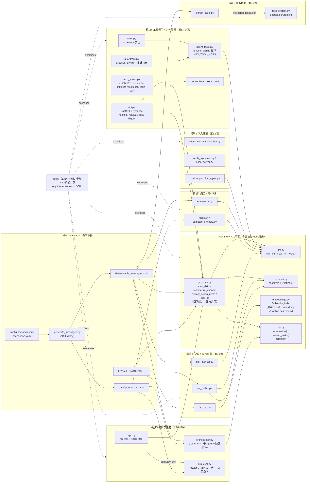

# 项目架构：完整课程模块依赖图

给助教/讲师核对项目全貌用的一张图，覆盖全部14个 session、6大模块。**学员不用在第1课就通读这份**——随着课程推进，对应模块会逐一在正文里出现；第1课只需要看 [ARCHITECTURE.md](ARCHITECTURE.md) 里那两个脚本。

## 怎么读这张图

- **左到右 = 数据生成 → 共享库 → 课程模块 → 打分**：`slack-simulator/` 产出的 JSONL + ground truth 是所有教学模块的统一输入；`common/` 是所有模块共享的基础设施；第12课把第11课的输出对照 ground truth 打分，闭环。
- **common/ 是唯一的"生产级细节"聚集地**：LLM 调用降级、chunking、TF-IDF/embedding 双检索、摘要/抽取逻辑都在这里——学生看这几个文件就能理解"离线可跑 + 有 key 自动升级"的设计原则，而不用在十几个 session 里重复看到同一段降级逻辑。
- **`assistant.py` 是"教学版 vs 可复用版"的分界线**：图上有三条箭头指向它——`app.py`（第11课，边跑边打印）、`mcp_server.py` 和 `api.py`（第14课，返回数据、保持安静）。**逻辑只有一份，形态有两种。** 第三个调用方出现的那一刻，就是复制粘贴不再可接受的那一刻。
- **模块3 是唯一有严格文件依赖的模块**（session-06 写 `extracted_tasks.json`，session-07 读它）——其余模块都是并列地消费 `slack-simulator/data/`，没有跨session的文件耦合，这也是为什么模块4、5可以并行讲或调换顺序。
- **模块6 的方向和前面五个相反**：模块 1–5 是"我们调模型"，第13课是"模型调我们的工具"，第14课是"别人的 agent 和别人的浏览器调我们"。**依赖箭头掉了个头，护栏就成了必需品**——`guardrails.py` 存在的全部理由。
- **测试套件（`tests/`）覆盖全部模块**，且全部在 mock 模式下运行（不需要任何 API key），是 CI（`.github/workflows/ci.yml`）里跑的内容——学生/助教改代码后跑 `pytest` 就知道有没有破坏其他模块的假设。
