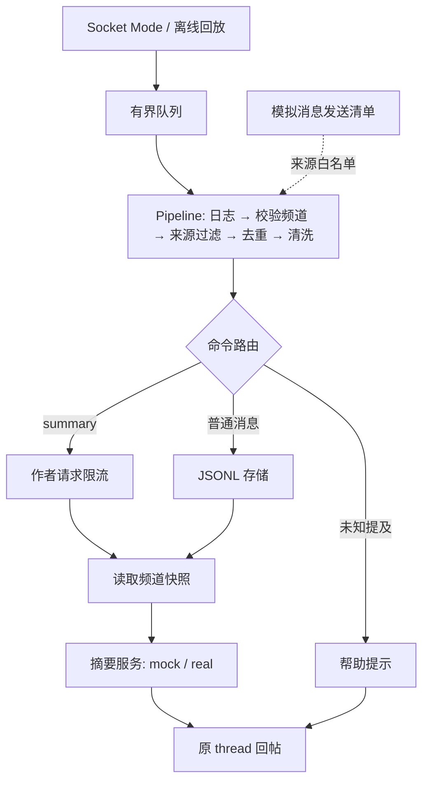

# Pipeline Demo Spec · Review 版

版本：v0.3 · 2026-09-12 · **已实现并完成验收** · 预计阅读 3–5 分钟

运行入口及参数见 [README](README.md)，验证范围与限制见 [验收记录](DEMO_VALIDATION.md)。

## 1. 做什么

在 [#l2_demo](https://app.slack.com/archives/C0C16PDBFHR) 自动收集普通讨论和登记的模拟消息；用户发送 `@slack_assistant summary` 后，Bot 总结本地已收集的内容，在原 thread 回帖。

- **L2**：讲接入、Pipeline、存储和限流，用 mock 摘要跑通链路。
- **L3**：同一接口换真实摘要；支持 `summary engineer` / `summary manager`，默认 engineer。
- 普通讨论静默保存；命令、摘要回复和帮助提示不进入摘要材料。
- MVP 单频道、单进程、单 worker、本地 JSONL。历史抓取、编辑/删除同步、持久任务队列不在本次范围。

## 2. 高层流程



Bolt 管理协议 ack；接收回调只做快速入队，不等待模型。worker 按入队顺序处理，查询记录按消息时间排序。摘要使用读取时的固定快照，不宣称覆盖完整频道历史。

## 3. 模块与接口

所有路径相对 `course-demos/`；以下为实现的模块边界。

| 文件 | 职责 / 主要接口 |
|---|---|
| `common/message_pipeline.py` | 共享 `Pipeline.use/run`；中间件签名 `middleware(ctx, next_) -> Result` |
| `common/message_store.py` | `append_if_absent(message)`、`snapshot(team, channel)`；JSONL 重载和幂等保存 |
| `common/summarization.py` | 从 L3 提取摘要核心；`summarize(snapshot, audience, strategy, mock)` |
| `session-03-pipeline-agent/slack_pipeline_demo.py` | CLI、配置、队列/worker、命令路由、摘要限流、运行日志 |
| `session-03-pipeline-agent/slack_adapter.py` | Bolt 事件监听、回帖、FakeClient；`send_reply(channel, thread_ts, text)` |
| `session-03-pipeline-agent/demo_fixtures.py` | 已有 manifest 加载、离线事件构造、模拟消息白名单 |
| `session-03-pipeline-agent/seed_demo.py` | 显式发送 short/long 固定剧情；逐条保存成功返回的 ts，通知白名单 |

**复用规则**：现有 `pipeline.py` 保留最小教学入口，复用共享 Pipeline；`summarize.py` 保留文件输入入口，委托共享摘要核心。模型选择只在 `common/llm.py`；不改后续课程的 `common/assistant.py`，不跨 session 动态导入。

**数据契约**：

```text
Message = {event_id, team_id, channel, ts, thread_ts, user_id, bot_id,
           text, source, demo_run_id?, simulation_actor?}
Result  = {status, reason?, event_id, message_key?, reply_ts?}
status  = stored | replied | ignored | duplicate | rate_limited | failed
```

`ts` 保留字符串；消息键为 `(team_id, channel, ts)`，投递键为 `event_id`。`source` 区分 `slack_live`、`manifest_replay` 和 `fixture`。实际 Bot 身份与模拟角色分别保存。

**身份规则**：`user_id` 表示发送主体，规范化后必须非空，不拿模拟角色冒充真实 Slack 用户。去重键不依赖 `user_id`。

| 输入 | `user_id` 来源 | 模拟角色及限流 |
|---|---|---|
| 真实用户消息/命令 | Slack `event.user`；缺失则拒绝，reason=`missing_user_id` | 摘要按真实请求者计数 |
| 登记的自发 Bot 素材 | 使用 `event.user`；缺失时，在确认来源为当前 Bot 后使用 `auth.test.user_id` | Alice/Bob 仅存 `simulation_actor`；同一 Bot 共享发送身份是正确行为；素材不执行命令、不进入摘要限流 |
| 旧 manifest 回放 | 固定 `demo:bot`，workspace 固定 `demo:manifest` | `actor` 映射为 `simulation_actor`；缺失时为 null，不从长文本猜单一作者 |
| 离线用户命令 fixture | 显式固定 ID，例如 `fixture:user:alice`、`fixture:user:bob`；workspace 为 `demo:manifest` | 两位请求者身份稳定且不同，用于验证限流隔离；不可从正文或运行时随机生成 |

离线合成摘要命令默认由 `fixture:user:alice` 发出；它与素材作者无关，不能用六条 Bot 素材验证“不同请求者”的限流。

## 4. 必须遵守的处理规则

| 问题 | 决策 |
|---|---|
| 日志 | 最外层包裹整个调用，记录最后状态、拦截原因和耗时；不打印凭据 |
| 两种监听 | `message` 处理普通讨论并跳过直接提及当前 Bot 的消息；`app_mention` 只处理命令 |
| Bot 过滤 | 仅放行匹配发送清单、频道和 Bot 身份的模拟素材；不按 `[模拟]` 文本前缀放行；素材从不解释为命令 |
| 去重 | event_id 防重投递；消息键防双订阅重复。写入成功才标完成；失败可显式重试，不把 seen 当成功 |
| 清洗 | 去首尾空白，保留大小写、作者、时间和线程；不做 LLM 意图分类 |
| 限流 | **只限摘要**：同一 workspace/频道/用户滚动 60 秒接受 3 次；第 4 次拒绝；满 60 秒移出；拒绝不计数，接受后失败计数；注入时钟测试 |
| 摘要 | 空记录直接提示；显示模式、条数和时间范围。采用更正后的事实，区分假设/确认、回滚/恢复，不编造未知项 |
| 长输入 | 默认单次摘要；按模型 token 预算检查，预留指令/输出；估算需标明。超限明确失败，不静默截断；Map-Reduce 作为 L3 显式扩展，保留来源和中间结果 |
| mock | 基于实际原文做确定性摘录，标注截取；支持中文素材。显式 mock 禁止 LLM 网络调用，不硬编码正确答案 |
| 回帖失败 | 保存摘要结果，显式重试可复用；发送超时标为结果未知，不自动重复发送 |
| 队列/重启 | 队列满记录覆盖不完整；重启恢复消息文件，不承诺恢复排队任务或恰好一次回帖 |

**与旧 L2 练习区分**：现有 `rate_limit` 练习限制所有消息，本 demo 的 `summary_rate_limit` 只限制摘要请求。两者虽都用“60 秒 3 次”，不能直接把旧中间件注册到采集链上；README 明示差异，限流测试使用用户命令 fixture。

**模拟 Bot 消息的两个实现检查点**：

1. Bolt 可能在 listener 前过滤自身消息。检查安装版本，在本 demo 入口调整 SDK 过滤，再由严格来源白名单决定是否放行；必须真实验证 seed 事件到达。
2. 事件可能早于发帖返回到达。仅在活动 seed 批次中，用有限 pending 缓冲等待 ts 登记，匹配后重新入队，超时忽略；不得阻塞唯一 worker。生成器不能直接写消息存储来假装实时链路成功。

## 5. 素材、权限与运行

**现有素材**（独立场景，默认不混合）：

- [6 条短消息清单](../outputs/slack-demo/l2-demo-20260912T074451Z.json)。
- [1 条长消息清单](../outputs/slack-demo/l2-long-20260912T075151Z.json)，约 2,900 字符；内部多个发言仍计作一条 Slack 消息。

这些消息已经发布。离线模式从清单构造事件；未来启动监听器不会自动收到它们。旧清单缺少 team_id，离线用合成 workspace 标识，角色 `actor` 映射为 `simulation_actor`；真实模式从鉴权结果取得身份。

`course-demos/outputs/` 已加入 `.gitignore`；上述清单是本地运行产物。已提供 `fixtures/short.json`、`fixtures/long.json`，新 clone 无需这些本地文件也能离线演示。

**权限现状**：Bot 已具有 `channels:history`、`app_mentions:read`、`chat:write`。实时前核验 `message.channels`/`app_mention` 订阅、Bot 在目标频道、Socket Mode 与 App Token `connections:write`。不需要新增角色定制权限。

**CLI**（入口为 `slack_pipeline_demo.py`）：

| 参数 | 行为 |
|---|---|
| `--offline --manifest <path>` | 强制 mock + FakeClient；导入素材并回放一个合成摘要命令；全程不联网 |
| `--socket --channel C0C16PDBFHR --mock` | 真实 Slack，摘要使用 mock；不自动发送素材 |
| 上一行加 `--seed short` 或 `--seed long` | 监听就绪后显式发送新素材；同进程 registry 接收发送回执 |
| `--socket --channel C0C16PDBFHR` | 真实 Slack，按现有配置选择模型；无 key 使用明确标记的 mock |

每次默认新建 `outputs/slack-demo/<run-id>/`，包含 `manifest.json`（seed 时）、`messages.jsonl`、`trace.jsonl`、`summary_runs.jsonl`；`--store-dir` 显式复用记录。运行记录保存摘要输入消息键和结果。已有频道不重复创建，启动不隐式发帖或拉历史。

## 6. 验收与实现顺序

**自动化必须验证**：

- 普通消息落盘但不回复；重复事件/双订阅只处理一次；跨频道不混合。
- 登记素材放行、普通 Bot 回复忽略；模拟登记竞争不会死锁或丢失已匹配消息。
- 摘要命令不入库；读取真实存储快照；thread 参数正确；限流不影响讨论保存。
- 身份规则：Alice/Bob 素材共享 Bot 发送身份但保留各自模拟角色；两个固定用户命令分别计数；缺失真实请求者 ID 明确拒绝。
- 空记录、限流边界、存储/模型/回帖失败、队列满均有明确状态。
- offline 即使配置了真实 key 也不联网；慢模型不阻塞接收回调；重载不重复存储。

**真实验收**：监听后 seed 6 条，确认 `posted=6` 且 `stored=6`；用户再发普通讨论和摘要命令，Bot 正确回 thread，摘要回复不再入库。用长素材人工检查：1,260 请求 / 430 用户 / 512 订单不混淆；回滚不等于恢复；根因和重复扣款尚待确认。

**实现顺序**：① 共享核心 + 存储 + 离线闭环 → ② Socket 接入 + seed 白名单 → ③ L3 真实摘要与可选 Map-Reduce → ④ 测试及运行说明。以上已完成；真实监听是按需启动的教学进程，不是持续部署的服务。
